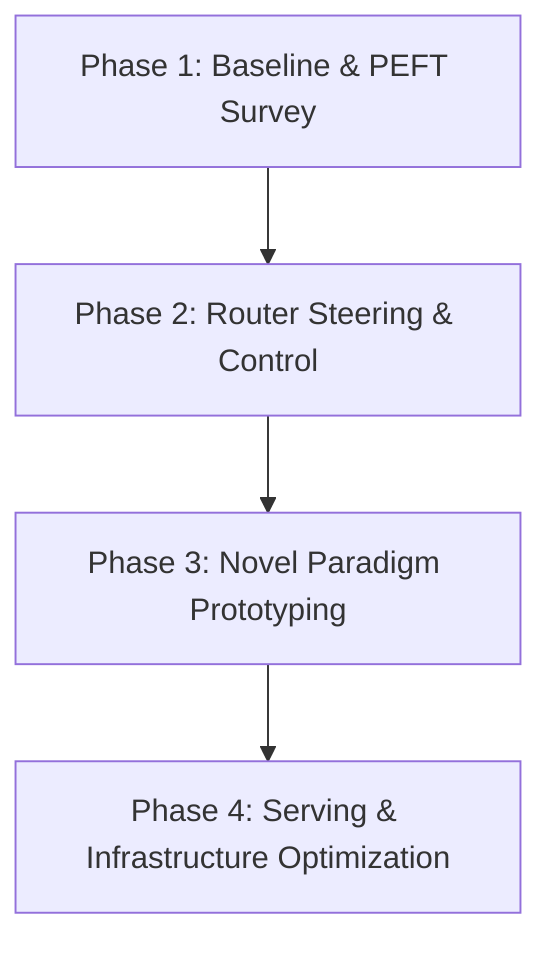

# High-Level Goals & Research Roadmap

This document outlines the core strategic research and engineering goals for Parameter-Efficient Fine-Tuning (PEFT), Mixture-of-Experts (MoE) adapter routing, dynamic post-hoc steering, and small MoE model optimization.

---

## Core Objectives

### 1. Experiment with & Benchmark LoRA & MoE-LoRA Variations
- **MoE-LoRA & X-LoRA**: Benchmark dynamic token-level router mechanisms that blend multiple specialized task/domain adapters.
- **MixLoRA**: Evaluate multi-adapter routing performance during multi-task fine-tuning.
- **TT-LoRA MoE**: Investigate decoupled two-stage training strategies (independent expert training followed by router adaptation).

### 2. Improve & Refine PEFT Adapter Variations
- Address parameter efficiency and convergence limits across modern PEFT techniques (QLoRA, VeRA, DoRA, PiSSA, AdaLoRA).
- Explore dynamic rank allocation ($r=0$ to $r=64$) based on token/query complexity to optimize VRAM and compute utilization.

### 3. Optimize Expert Routing & Post-Hoc Steering Mechanisms
- Develop zero-cost inference-time expert steering (logit biasing, expert masking, dynamic steering vectors, and Hessian-Aware Calibration).
- Eliminate cross-task interference and routing instability in sparse MoE gating layers without requiring full backpropagation retraining passes.

### 4. Overcome Efficiency & Capacity Limits in Small MoE Models
- Solve the "Expert Capacity Floor" constraint in small parameter models (e.g., sub-1B/3B experts) where shallow sub-networks struggle with complex multi-step reasoning.
- Mitigate memory latency bottlenecks caused by sparse/non-contiguous memory access patterns on consumer GPU hardware.

---

## Phased Execution Roadmap

### Phase 1: Baseline Analysis & PEFT Survey
- [ ] Benchmark parameter efficiency, training stability, and inference latency of standard LoRA against PEFT alternatives ($\text{IA}^3$, Houlsby Adapters, Prefix Tuning).
- [ ] Evaluate convergence innovations (DoRA, PiSSA) and memory-compressed adapters (QLoRA, VeRA) against full baseline fine-tuning.

### Phase 2: Inference-Time Router Steering & Control
- [ ] Implement and test PyTorch forward hooks for router logit manipulation (`steered_router_hook`).
- [ ] Benchmark Soft Steering (Logit Bias), Hard Override (Expert Masking), Dynamic Steering Vectors, and Router Calibration (HARC).
- [ ] Measure behavioral steerability vs. output quality degradation ("The Catch") across model scales.

### Phase 3: Novel Paradigm Prototyping
- [ ] **Rule-Gated / Grammar-Guided MoE-LoRA**: Prototype deterministic AST/syntax mask overrides on neural router gating outputs.
- [ ] **Activation-Steered MoE-LoRA**: Prototype zero-training router steering using Sparse Autoencoders (SAEs) or activation vectors.
- [ ] **Context-Adaptive Dynamic Rank Allocator**: Implement token-level adaptive rank assignment ($r$) to scale compute dynamically.

### Phase 4: Serving & Infrastructure Optimization
- [ ] Address multi-adapter dynamic mixture serving bottlenecks in vLLM / llama.cpp.
- [ ] Implement custom fused CUDA/HIP dynamic routing kernels for high-throughput execution.

---

## Navigation & Cross-References

- **Technical Concepts & Research Deep Dive**: See [IDEAS.md](file:///home/mihai/gnn-experiment/IDEAS.md)
- **Experimental Tracking & Implementation Logs**: See [EXPERIMENTS.md](file:///home/mihai/gnn-experiment/EXPERIMENTS.md)
