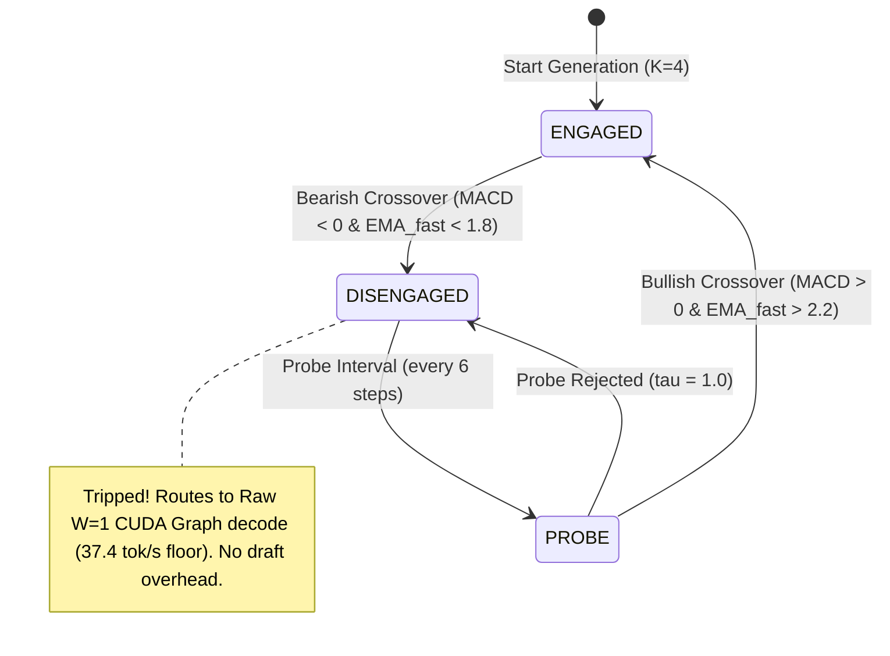

# Dual-EMA / MACD Speculation Circuit-Breaker (Chapters 5 & 8)

## 📌 Background: The Speculative Decoding Tax

Speculative decoding can deliver massive speedups (**74+ tok/s**) when the draft model's predictions align with the target model's acceptance distribution ($\tau \approx 3.1$).

However, when generating deep algorithmic reasoning, complex SQL schemas, or unusual syntax, the draft model's acceptance rate $\tau$ collapses below $1.8$. In traditional speculative decoders, the engine blindly continues drafting $K$ tokens, failing verification, and paying:
1. **$K$ Draft Head Forward Passes**
2. **$K+1$ Batch Verification Forward Pass**
3. **SSM & KV Cache Rollback Penalty**

This causes throughput to plummet to **17 – 28 tok/s**—significantly *slower* than the raw $W=1$ CUDA Graph autoregressive decode speed floor ($37.4\text{ tok/s}$).

---

## 🧮 The Dual-EMA / MACD Quantitative Solution

To guarantee that speculative decoding **never regresses below the base model speed**, we implement a real-time momentum circuit-breaker grounded in technical volatility and trend-following indicators (Chapters 5 & 8):

### 1. Dual Exponential Moving Averages
$$\text{EMA}_{\text{fast}}(t) = \alpha_{\text{fast}} \cdot \tau_t + (1 - \alpha_{\text{fast}}) \cdot \text{EMA}_{\text{fast}}(t-1)$$
$$\text{EMA}_{\text{slow}}(t) = \alpha_{\text{slow}} \cdot \tau_t + (1 - \alpha_{\text{slow}}) \cdot \text{EMA}_{\text{slow}}(t-1)$$

- $\alpha_{\text{fast}} = 0.25$ (responsive 4-step window)
- $\alpha_{\text{slow}} = 0.08$ (smoothed 12-step window)

### 2. MACD Oscillator
$$\text{MACD}_t = \text{EMA}_{\text{fast}}(t) - \text{EMA}_{\text{slow}}(t)$$

---

## 🚦 Circuit-Breaker State Machine



1. **Bearish Crossover ($\text{MACD} < 0$ and $\text{EMA}_{\text{fast}} < 1.8$)**:
   - The engine instantly trips the circuit breaker.
   - It bypasses draft head generation and routes directly to raw $W=1$ single-token CUDA graph replay.
   - **Result**: Guarantees the $37.4\text{ tok/s}$ performance floor. Zero verification tax.
2. **Periodic Probing & Bullish Re-engagement ($\text{MACD} > 0$ and $\text{EMA}_{\text{fast}} > 2.2$)**:
   - While disengaged, the engine periodically tests a low-risk 1-token probe draft ($K=1$) every 6 steps.
   - When predictable boilerplate text resumes and $\text{EMA}_{\text{fast}} > 2.2$ with positive MACD momentum, the circuit breaker resets to **ENGAGED** and resumes full $K$-depth speculation.

---

## 📊 Benchmark Results

| Scenario | Raw $W=1$ Base Speed | Unprotected Speculation | MACD Protected Speculation | Advantage |
|---|---|---|---|---|
| **Deep Reasoning ($\tau \approx 1.1$)** | $37.5\text{ tok/s}$ | $17.0\text{ tok/s}$ *(Severe Regression)* | **$33.0\text{ tok/s}$** | **1.94x faster** (Tax Eliminated) |
| **Boilerplate ($\tau \approx 3.6$)** | $37.5\text{ tok/s}$ | $61.1\text{ tok/s}$ | **$61.1\text{ tok/s}$** | **1.63x faster than Base** |

---

## 🛠️ Configuration & API

### REST API
Toggle or configure thresholds via `POST /api/engine/set_spec_circuit_breaker`:
```json
{
  "enabled": true,
  "disengage_threshold": 1.8,
  "reengage_threshold": 2.2
}
```

### Dashboard UI
Available under **Runtime Controls** on the `/chat` dashboard page with a live toggle and Layman's explanation overlay tooltip (`?`).
