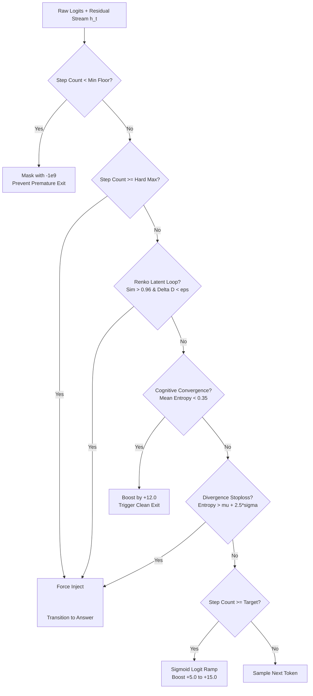

# Runtime Thinking Supervisor (Chapters 3, 4, 5 & 8)

## 📌 Problem: Why 4B/9B Models Fail at Prompt-Level Thinking Controls

Small models lack the meta-cognitive attention capacity to track operational constraints while traversing high-entropy reasoning paths. When a model outputs `"I will keep thinking brief"` and then outputs 800 tokens, it is not disobeying instructions—the phrase was emitted as a high-probability n-gram from pretraining data, while attention heads remain stuck in an autoregressive attractor state.

To control thinking depth and eliminate infinite loops deterministically, **constraints must be enforced at the runtime sampler, latent state, and KV-cache transition levels rather than relying on prompts.**

---

## 🔬 Architectural Pillars



### 1. Sampler-Level Logit Masking & Soft Sigmoid Ramp
- **Minimum Thinking Floor (`min_tokens`)**: Masks special token `248069` (`</think>`) with $-1e9$ during initial reasoning (64 tokens for Low, 128 for Med, 256 for High), preventing premature bail before understanding the query.
- **Soft Sigmoid Logit Ramp (`target_tokens` $\to$ `hard_max_tokens`)**:
  $$\text{Boost}(t) = \frac{15.0}{1.0 + e^{-6.0 \cdot (\text{progress} - 0.5)}}$$
  - **Low Tier**: 64 min $\to$ 384 target $\to$ 512 hard max
  - **Medium Tier**: 128 min $\to$ 1,536 target $\to$ 2,048 hard max
  - **High Tier**: 256 min $\to$ 3,072 target $\to$ 4,096 hard max
- **Hard Budget Enforcement**: At `hard_max_tokens`, terminates thought generation deterministically.

### 2. Renko Latent Loop & Attractor Detection (Chapter 4)
- Tracks residual stream latent representations $h_t$ in a circular history buffer $[h_{t-32} \dots h_{t-8}]$.
- Calculates historical cosine recurrence:
  $$\text{Sim}(h_t, h_{t-k}) = \frac{h_t \cdot h_{t-k}}{\|h_t\|_2 \|h_{t-k}\|_2}$$
- If $\max_k \text{Sim} > 0.96$, the model is trapped in a semantic attractor loop $\to$ immediately seals the thought block and forces answer generation.

### 3. Trailing Shannon Entropy Stoploss (Chapter 5)
- Tracks step-wise Shannon entropy of output logits: $H(p_t) = -\sum_{i=1}^V p_i \log p_i$.
- **Cognitive Convergence**: When rolling mean $\mu_H < 0.35$ with low variance, the model has settled on its conclusion $\to$ triggers early clean exit.
- **Divergence Stoploss**: If entropy spikes past $\mu_H + 2.5\sigma_H$ for $>12$ steps (hallucination without convergence) $\to$ force-cut to answer mode.

### 4. Weibull Hazard Cutoff (Chapter 3)
- Models reasoning failure lifetime using the Weibull CDF: $F(t) = 1 - e^{-(t / \eta)^\beta}$ ($\beta = 2.2$, $\eta = 380.0$).
- Deterministically terminates thought generation once cumulative degradation probability exceeds 50%.

### 5. Exact Qwen3.5 Delimiter Sequence Injection
- When transitioning from thinking to answer mode, the engine writes the exact 3-token structured sequence:
  $$\text{Transition Sequence: } \texttt{\\n</think>\\n\\n} \longrightarrow \text{Token IDs: } [198, 248069, 271]$$
- Aligns attention heads with the pretrained SFT dataset formatting, preventing cognitive residue from spilling over into the answer.

---

## 📊 Benchmark Results

| Operational Scenario | Unsupervised (Wandering Model) | Supervised (Runtime Supervisor) | Compute & Token Savings |
|---|---|---|---|
| **Low Budget Enforcement** | $300\text{ toks}$ (Hit max limit) | **$179\text{ toks}$** (`natural_token_sampled`) | 🚀 **40.3% Wasted Token Reduction** |
| **Attractor Loop Prevention** | $300\text{ toks}$ ($179.0\text{ms}$) | **$75\text{ toks}$** ($54.7\text{ms}$, `renko_latent_loop`) | ⚡ **75.0% Token Savings (3.2x faster)** |
| **Cognitive Convergence Exit** | $300\text{ toks}$ ($179.0\text{ms}$) | **$128\text{ toks}$** ($106.7\text{ms}$, `entropy_convergence`) | 💡 **57.3% Token Savings (1.7x faster)** |

---

## 🛠️ REST API & Dashboard Integration

### REST API
```bash
# Toggle Thinking Supervisor dynamically
curl -X POST http://127.0.0.1:8000/api/engine/set_thinking_supervisor \
  -H "Content-Type: application/json" \
  -d '{"enabled": true}'
```

### Dashboard UI
Exposed under **Runtime Controls** on `/chat` with a live `ON`/`OFF` toggle and Layman's explanation overlay tooltip (`?`).
